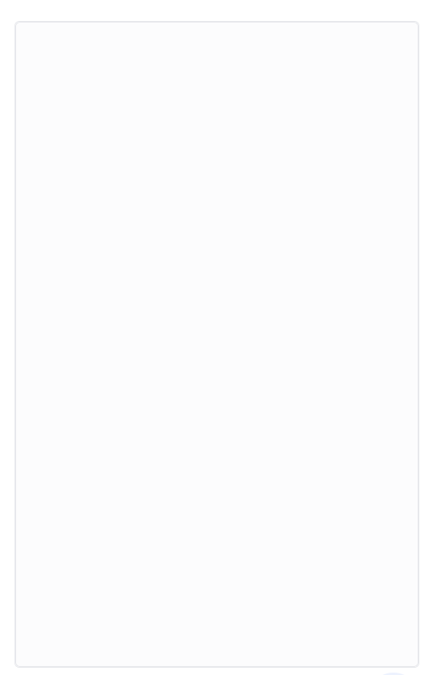
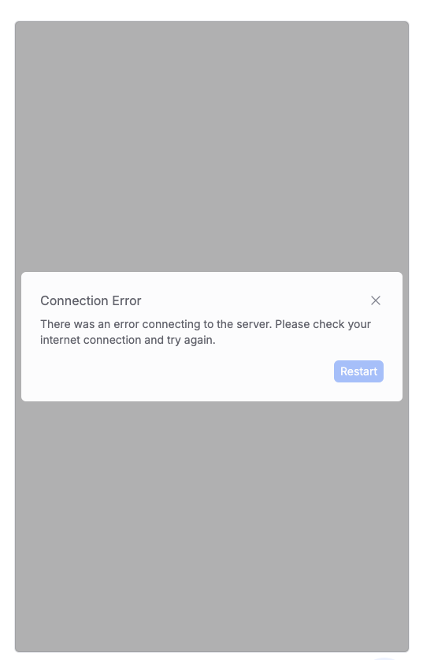

The `Container` wraps the core Webchat interface.
It manages:

- Layout 
- Drag-and-drop file uploading
- Connection status feedback

It also provides a shared context for nested components like `MessageList` and `Composer`.

<AccordionGroup>
  <Accordion title="Empty Container">
    
  </Accordion>
  <Accordion title="Disconnected Container">
    
  </Accordion>
</AccordionGroup>

## Usage

<Note>
  We recommend using the `Container` as the top-level wrapper around your Webchat content.
</Note>

```jsx App.jsx
import { Container, useWebchat } from '@botpress/webchat'

function App() {
  const [isWebchatOpen, setIsWebchatOpen] = useState(false)

  const { clientState } = useWebchat({
    clientId: '$CLIENT_ID$', // Insert your Client ID here
  })

  return (
    <Container
      connected={clientState !== 'disconnected'}
      style={{
        width: '500px',
        height: '800px',
        display: isWebchatOpen ? 'flex' : 'none',
        position: 'fixed',
        bottom: '90px',
        right: '20px',
      }}
    >
      // Your webchat content goes here
    </Container>
  )
}
```

## Props

<ResponseField name="connected" type="boolean">
  Indicates whether the Webchat is currently connected. When `false`, a modal appears and prompts the user to retry by reloading the page.
</ResponseField>

<ResponseField name="...props" type="ComponentProps<'div'>">
  All standard `<div>` props are passed through, allowing further customization like styling or event handlers.
</ResponseField>
