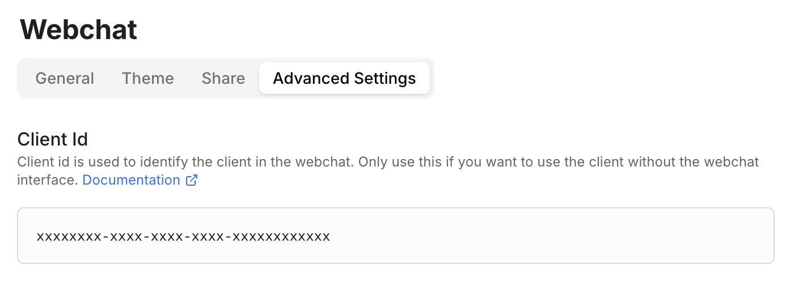
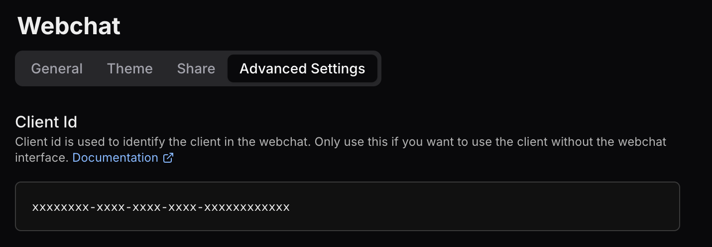

Botpress offers a **fully customizable React library** that lets you seamlessly add Webchat to your existing React projects.

## Step 1: Installation

<Info>
  You will need:

  - A [published bot](/learn/get-started/quick-start)
  - A [React app](https://react.dev/learn/installation)
</Info>

<Note>
  The Webchat library currently requires React 18. Make sure your project is using this version to avoid compatibility
  issues.
</Note>

### Install the NPM package

The Webchat library is hosted on `npm`. Download it with your favorite package manager:

  <CodeGroup>

  ```bash npm
  npm install @botpress/webchat
  ```

```bash yarn
yarn add @botpress/webchat
```

```bash pnpm
pnpm install @botpress/webchat
```

  </CodeGroup>

### Obtain your Client ID

To integrate the Webchat client into your application, you need to obtain your bot's Client ID.
This ID identifies your bot and enables communication with the Webchat service.

To get your bot's Client ID:

1. From the [Dashboard](/learn/get-started/dashboard/), select your bot.
2. In the left navigation bar, select **Webchat**.
3. Select the **Advanced Settings** tab.
4. Copy the **Client ID**:

  <Frame>
    
    
  </Frame>

---

## Step 2: Build a component

The library gives you two options for building a full Webchat experience:

### Option 1: Use the `Webchat` component

The library provides a batteries-included [Webchat](/webchat/react-library/components/webchat) component that contains most of what you'd expect when [injecting Webchat](/webchat/get-started/quick-start).

With this approach, the only other component you need to import is the [Fab](/webchat/react-library/components/fab). Here's an example implementation:

``` jsx App.jsx expandable
import { Fab, Webchat } from '@botpress/webchat'
import { useState } from 'react'

function App() {
  const [isWebchatOpen, setIsWebchatOpen] = useState(false)
  const toggleWebchat = () => {
    setIsWebchatOpen((prevState) => !prevState)
  }
  return (
    <>
      <Webchat
        clientId="$CLIENT_ID$" // Your client ID here
        style={{
          width: '400px',
          height: '600px',
          display: isWebchatOpen ? 'flex' : 'none',
          position: 'fixed',
          bottom: '90px',
          right: '20px',
        }}
      />
      <Fab
        onClick={() => toggleWebchat()}
        style={{
          position: 'fixed',
          bottom: '20px',
          right: '20px',
          width: '64px',
          height: '64px'
        }}
      />
    </>
  )
}

export default App
```

### Option 2: Build Webchat manually

If you need more customization over each part of the Webchat experience, you can build it manually using the rest of the component library. Here's an example implementation:

```jsx App.jsx expandable
import { Container, Header, MessageList, Composer, useWebchat, Fab } from '@botpress/webchat'
import { useState, useMemo } from 'react'

const headerConfig = {
  botName: 'SupportBot',
  botAvatar: 'https://cdn.botpress.cloud/bot-avatar.png',
  botDescription: 'Your virtual assistant for all things support.',

  phone: {
    title: 'Call Support',
    link: 'tel:+1234567890',
  },

  email: {
    title: 'Email Us',
    link: 'mailto:support@example.com',
  },

  website: {
    title: 'Visit our website',
    link: 'https://www.example.com',
  },

  termsOfService: {
    title: 'Terms of Service',
    link: 'https://www.example.com/terms',
  },

    privacyPolicy: {
    title: 'Privacy Policy',
    link: 'https://www.example.com/privacy',
  },
}

function App() {
  const [isWebchatOpen, setIsWebchatOpen] = useState(true)
  const { client, messages, isTyping, user, clientState, newConversation } = useWebchat({
    clientId: '892072aa-0b89-47e0-800c-8da8f387d757', // Insert your Client ID here
  })

  const config = {
    botName: 'SupportBot',
    botAvatar: 'https://picsum.photos/id/80/400',
    botDescription: 'Your virtual assistant for all things support.',
  }
  const enrichedMessages = useMemo(
  () =>
    messages.map((message) => {
      const { authorId } = message
      const direction = authorId === user?.userId ? 'outgoing' : 'incoming'
      return {
        ...message,
        direction,
        sender:
          direction === 'outgoing'
            ? { name: user?.name ?? 'You', avatar: user?.pictureUrl }
            : { name: config.botName ?? 'Bot', avatar: config.botAvatar },
      }
    }),
  [config.botAvatar, config.botName, messages, user?.userId, user?.name, user?.pictureUrl]
  )

  const toggleWebchat = () => {
    setIsWebchatOpen((prevState) => !prevState)
  }

  return (
    <>
    <Container
      connected={clientState !== 'disconnected'}
      style={{
        width: '500px',
        height: '800px',
        display: isWebchatOpen ? 'flex' : 'none',
        position: 'fixed',
        bottom: '90px',
        right: '20px',
      }}
    >
      <Header
        // onOpenChange={() => console.log('Override the header open change')}
        defaultOpen={false}
        closeWindow={() => setIsWebchatOpen(false)}
        restartConversation={newConversation}
        disabled={false}
        configuration={headerConfig}
      />
      <MessageList
        // botAvatar={config.botAvatar}
        botName={config.botName}
        botDescription={config.botDescription}
        isTyping={isTyping}
        headerMessage="Chat History"
        showMarquee={true}
        messages={enrichedMessages}
        sendMessage={client?.sendMessage}
      />
      <Composer
        disableComposer={false}
        isReadOnly={false}
        allowFileUpload={true}
        connected={clientState !== 'disconnected'}
        sendMessage={client?.sendMessage}
        uploadFile={client?.uploadFile}
        composerPlaceholder="Type a message..."
      />
    </Container>
    <Fab onClick={() => toggleWebchat()} style={{ position: 'fixed', bottom: '20px', right: '20px', width: '64px', height: '64px' }}/>
    </>
  )
}

export default App
```

<Check>
  You just built your first Webchat component!
</Check>

## Step 3: Configure Webchat

The `Webchat` component doesn't use the configuration set in your bot's [Dashboard](/webchat/get-started/configure-your-webchat). Instead, follow the steps below to add custom configuration and styles:

### If you're using the `Webchat` component

If you use the batteries-included `Webchat` component, use the [`configuration`](/webchat/react-library/components/webchat#param-configuration) prop to style Webchat.

You can also use any [custom CSS you set in the Dashboard](/webchat/get-started/configure-your-webchat#) by manually passing their URL into the [`additionalStylsheetUrl`](#additionalStylsheetUrl) prop. To get the stylesheet URL:

1. Navigate to your bot's Dashboard.
2. In the left sidebar, navigate to **Files**.
3. Select `webchatAdditionalStyles.css`.
4. Copy the `url`.

### If you're manually building Webchat

If you're manually building Webchat using the component library, use the [`StylesheetProvider`](/webchat/react-library/components/stylesheet-provider) component to style your implementation.

Each component also has various props that you can use for other configuration options—for example, the [`Header`](webchat/react-library/components/header#param-configuration) component's [`configuration`](webchat/react-library/components/header#param-configuration) prop.
