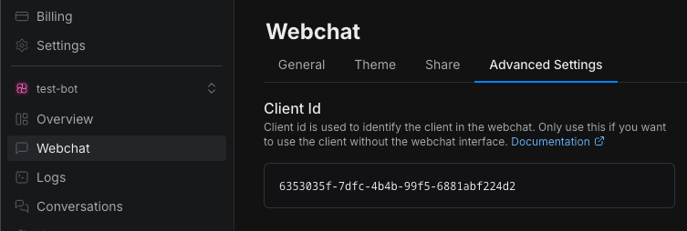

import { Img } from '/snippets/image.mdx'

<Info>
  You will need:

  - A [published bot](/learn/get-started/quick-start)
  - A working [React app](https://react.dev/learn/installation)
</Info>

<Note>
  Webchat currently requires React 18. Make sure your project is using this version to avoid compatibility
  issues.
</Note>

<Steps titleSize='h2'>
  <Step title="Install the NPM package">
The Webchat library is hosted on `npm`. Download it with your favorite package manager:

  <CodeGroup>
  ```bash npm
  npm install @botpress/webchat
  ```

```bash yarn
yarn add @botpress/webchat
```

```bash pnpm
pnpm install @botpress/webchat
```

  </CodeGroup>
</Step>

<Step title="Obtain your Client ID">
To integrate Botpress Webchat Client into your application, you need to obtain your bot's Client ID.
This ID identifies your bot and enables communication with the Webchat service.

To get your bot's Client ID:

1. Select your bot in your workspace.
2. In the left navigation bar, select **Webchat**.
3. Select the **Advanced Settings** tab.
4. Copy the **Client ID**:

  
  </Step>

<Step title="Build your component">

Now that we have everything we need, let's build a basic React component:

```tsx App.tsx [expandable]
import { Fab, Webchat } from '@botpress/webchat'
import { useState } from 'react'

function App() {
  const [isWebchatOpen, setIsWebchatOpen] = useState(false)
  const toggleWebchat = () => {
    setIsWebchatOpen((prevState) => !prevState)
  }
  return (
    <>
      <Webchat
        clientId="$CLIENT_ID$" // Your client ID here
        style={{
          width: '400px',
          height: '600px',
          display: isWebchatOpen ? 'flex' : 'none',
          position: 'fixed',
          bottom: '90px',
          right: '20px',
        }}
      />
      <Fab onClick={() => toggleWebchat()} style={{ position: 'fixed', bottom: '20px', right: '20px' }} />
    </>
  )
}

export default App
```
  </Step>
</Steps>

<Check>
  Congratulations! You just created your first Webchat component!
</Check>