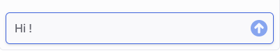

The `Composer` component is where the user writes messages before sending them to the bot.
It is a crucial part of the Webchat UI, providing a text area for input, optional file uploads, and integration with the chat system.



### Usage

<Note>
  Altough it can be use as a standalone component, the composer is designed to be used within the
  [Container](./container.mdx) component and alonside the [Header](./header.mdx) and [MessageList](./message-list.mdx)
  components.
</Note>

```tsx
import { Composer, useWebchatClient } from '@botpress/webchat'

function App() {
  const { client, clientState } = useWebchatClient({ clientId: '$CLIENT_ID$' }) // Insert your client id here

  return (
    <Composer
      disableComposer={false}
      isReadOnly={false}
      allowFileUpload={true}
      connected={clientState !== 'disconnected'}
      sendMessage={client?.sendMessage}
      uploadFile={client?.uploadFile}
      composerPlaceholder="Type a message..."
      showPoweredBy={true}
    />
  )
}
```

### Props

<ResponseField name="disableComposer" type="boolean">
  Disables the input field and sending capabilities when set to `true`. Disabling the composer is useful when you want
  to prevent user input temporarily, such as during a loading state or when waiting for a response from the bot.
</ResponseField>

<ResponseField name="isReadOnly" type="boolean">
  Removes the composer completely when set to `true`. This is useful for displaying messages without allowing user
  input.
</ResponseField>

<ResponseField name="allowFileUpload" type="boolean">
  Enables or disables the file upload button.
</ResponseField>

<ResponseField name="connected" type="boolean">
  Indicates whether the webchat is currently connected. When `false`, a modal appears prompting the user to retry by
  reloading the page.
</ResponseField>

<ResponseField name="sendMessage" type="(payload: Message) => void">
  A callback function for sending messages composed by the user.
</ResponseField>

<ResponseField
  name="uploadFile"
  type="(file: File) => Promise&lt;{ fileUrl: string; name: string; type: FileType }&gt;"
>
  Handles the file upload logic and returns file metadata upon success.
</ResponseField>

<ResponseField name="composerPlaceholder" type="string">
  Placeholder text displayed in the input area. Comes from the configuration.
</ResponseField>

<ResponseField name="showPoweredBy" type="boolean">
  Whether to show a "Powered by Botpress" label under the composer. Comes from the configuration.
</ResponseField>

<ResponseField name="...props" type="ComponentProps<'div'>">
  You can also pass standard `<div>` props to customize layout or styling.
</ResponseField>
