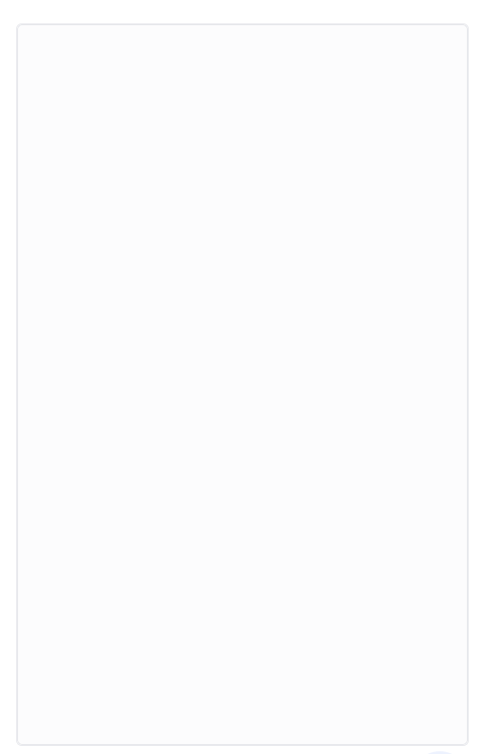
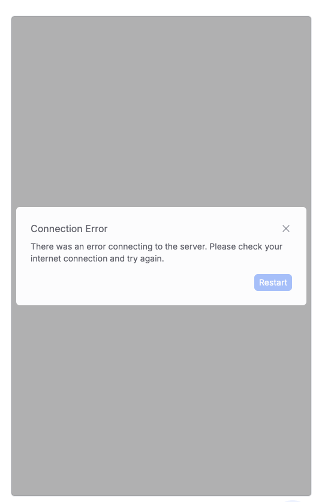

The `Container` wraps the core webchat interface.
It manages layout, drag-and-drop file uploading, connection status feedback, and provides a shared context for nested components like `MessageList` and `Composer`.

It should be used as the top-level wrapper around your webchat content.

_Empty Container_


_Disconnected Container_


### Usage

```tsx
import { Container, useWebchatClient } from '@botpress/webchat'

function App() {
  const [isWebchatOpen, setIsWebchatOpen] = useState(false)

  const { clientState } = useWebchatClient({
    clientId: '$CLIENT_ID$', // Insert your client id here
  })

  return (
    <Container
      connected={clientState !== 'disconnected'}
      style={{
        width: '500px',
        height: '800px',
        display: isWebchatOpen ? 'flex' : 'none',
        position: 'fixed',
        bottom: '90px',
        right: '20px',
      }}
    >
      // Your webchat content goes here
    </Container>
  )
}
```

### Props

<ResponseField name="connected" type="boolean">
  Indicates whether the webchat is currently connected. When false, a modal appears prompting the user to retry by
  reloading the page.
</ResponseField>

<ResponseField name="...props" type="ComponentProps<'div'>">
  All standard `<div>` props are passed through, allowing further customization like styling or event handlers.
</ResponseField>
