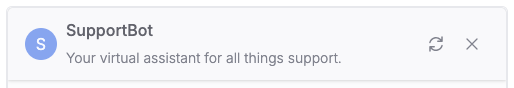
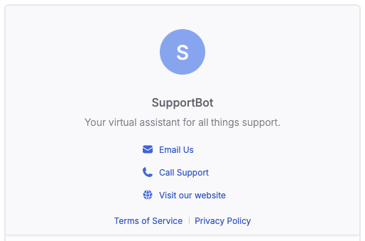

import { Img } from '/snippets/image.mdx'

The `Header` component sits at the top of the Webchat UI. It displays the bot’s name, avatar, and description. It also provides access to key actions like restarting the conversation or closing the chat window.

The `Header` can be collapsed or expanded:

<Tabs>
  <Tab title="Collapsed">
    
  </Tab>
  <Tab title="Expanded">
    
  </Tab>
</Tabs>

## Usage

<Note>
  Although you can use the `Header` as a standalone component, we recommend using it within the
  [Container](./container) component and alongside the [Composer](./composer) and [MessageList](./message-list) components.
</Note>

```jsx [expandable]
import { Header, useWebchat } from '@botpress/webchat'

// Every attributes that the header component can take
const headerConfig = {
  botName: 'SupportBot',
  botAvatar: 'https://cdn.botpress.cloud/bot-avatar.png',
  botDescription: 'Your virtual assistant for all things support.',

  phone: {
    title: 'Call Support',
    link: 'tel:+1234567890',
  },

  email: {
    title: 'Email Us',
    link: 'mailto:support@example.com',
  },

  website: {
    title: 'Visit our website',
    link: 'https://www.example.com',
  },

  termsOfService: {
    title: 'Terms of Service',
    link: 'https://www.example.com/terms',
  },

  privacyPolicy: {
    title: 'Privacy Policy',
    link: 'https://www.example.com/privacy',
  },
}

function App() {
  const [isWebchatOpen, setIsWebchatOpen] = useState(false)

  const { newConversation } = useWebchat({
    clientId: '$CLIENT_ID$', // Insert your client id here
  })

  return (
    <Header
      onOpenChange={() => console.log('Override the header open change')}
      defaultOpen={true}
      closeWindow={() => setIsWebchatOpen(false)}
      restartConversation={newConversation}
      disabled={false}
      configuration={headerConfig}
    />
  )
}
```

## Props

<ResponseField name="defaultOpen" type="boolean">
  Controls whether the header is expanded by default. Only used when the `open` prop is uncontrolled.
</ResponseField>

<ResponseField name="open" type="boolean">
  Explicitly controls whether the header is open. Useful for managing the open state from a parent component.
</ResponseField>

<ResponseField name="onOpenChange" type="(open: boolean) => void">
  Callback triggered when the open state changes. It overrides the default behavior of expanding the header. Receives
  the new open state as an argument.
</ResponseField>

<ResponseField name="disabled" type="boolean">
  Disables the header toggle functionality when set to `true`.
</ResponseField>

<ResponseField name="restartConversation" type="() => void">
  Optional function to restart the current conversation. Typically resets the conversation state to the beginning. The
  header must be within a `ModalProvider` for this to work. Such ModalProvider is provided automatically with the
  `Container` component.
</ResponseField>

<ResponseField name="closeWindow" type="() => void">
  Optional function to close the chat window. Useful for embedding scenarios or controlled UIs.
</ResponseField>

<ResponseField
  name="configuration"
  type="Pick<Configuration, 'email' | 'phone' | 'privacyPolicy' | 'website' | 'termsOfService' | 'botAvatar' | 'botDescription' | 'botName'>"
  required
>
  A configuration object containing bot identity and contact details. To enable the expanded header with additional
  links (e.g., website, terms of service), include the following fields: `email`, `phone`, `privacyPolicy`, `website`,
  and `termsOfService`.
</ResponseField>
