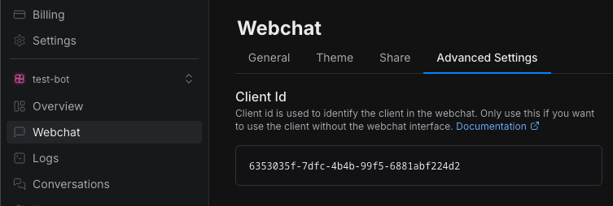

import { Img } from '/snippets/image.mdx'

## Quickstart

Before installing the Webchat package, make sure you have a React project set up and running.

<Note>
  Botpress Webchat currently requires React 18. Make sure your project is using this version to avoid compatibility
  issues.
</Note>

<Steps titleSize='h2'>
  <Step title="Install the NPM package">
The webchat library is hosted on `npm`. Download it with your favorite package manager.

  <CodeGroup>
  ```bash npm
  npm install @botpress/webchat
  ```

```bash yarn
yarn add @botpress/webchat
```

```bash pnpm
pnpm install @botpress/webchat
```

  </CodeGroup>
</Step>

<Step title="Obtain your Client ID">
To integrate Botpress Webchat Client into your application, you need to obtain your bot's Client ID.
This ID identifies your bot and enables communication with the Webchat service.

Follow these steps to retrieve it:

1. Select your bot in your workspace
2. Navigate to the Webchat page
3. Go to the Advanced Settings tab
4. Copy the Client ID
  </Step>
  <Step title="Basic Webchat component">



</Step>

<Step title="Basic Webchat component">

Now that we have everything required, we can proceed to build a basic webchat component

```tsx App.tsx
import { Fab, Webchat } from '@botpress/webchat'
import { useState } from 'react'

function App() {
  const [isWebchatOpen, setIsWebchatOpen] = useState(false)
  const toggleWebchat = () => {
    setIsWebchatOpen((prevState) => !prevState)
  }
  return (
    <>
      <Webchat
        clientId="$CLIENT_ID$" // Your client ID here
        style={{
          width: '400px',
          height: '600px',
          display: isWebchatOpen ? 'flex' : 'none',
          position: 'fixed',
          bottom: '90px',
          right: '20px',
        }}
      />
      <Fab onClick={() => toggleWebchat()} style={{ position: 'fixed', bottom: '20px', right: '20px' }} />
    </>
  )
}

export default App
```

**Congratulations you just created your first webchat component!**

  </Step>
</Steps>
